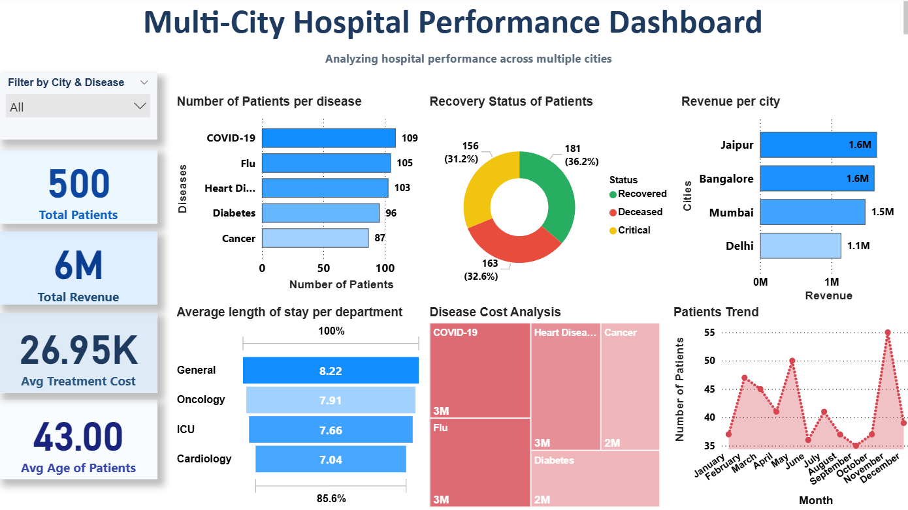

# 🏥 Enterprise-Grade Multi-City Healthcare Analytics & BI Staging Pipeline

🚀 **End-to-End Production Analytics Framework | Enterprise Data Engineering (Python) • Relational Database Architectures (MySQL) • Advanced Business Intelligence (Power BI)**

---

## 🗺️ Live System Architecture & Executive Dashboard Preview



> **Executive Statement:** This enterprise repository hosts a fully integrated, production-ready data engineering and business intelligence pipeline. Designed to eliminate operational blind spots, the architecture processes raw, multi-format transactional patient logs across major metro branches (Jaipur, Bangalore, Mumbai, Delhi). It programmatically sanitizes data anomalies via Python ETL, structures a normalized schema inside an optimized relational MySQL database engine, and synthesizes key operational metrics through high-velocity DAX models inside an interactive Power BI Executive Control Center.

---

## 📌 Table of Contents
1. [Executive Summary & Corporate Problem Statement](#1-executive-summary--corporate-problem-statement)
2. [Data Pipeline Architecture & System Design](#2-data-pipeline-architecture--system-design)
3. [Enterprise Schema Architecture & Comprehensive Data Dictionary](#3-enterprise-schema-architecture--comprehensive-data-dictionary)
4. [Production-Grade Python ETL Pipeline (Extract, Transform, Load)](#4-production-grade-python-etl-pipeline-extract-transform-load)
5. [Advanced SQL Analytical Engine (CTEs, Window Functions & Audits)](#5-advanced-sql-analytical-engine-ctes-window-functions--audits)
6. [Power BI Data Modeling & Advanced DAX Semantic Layer](#6-power-bi-data-modeling--advanced-dax-semantic-layer)
7. [Strategic Business Insights & Data-Driven Consulting Recommendations](#7-strategic-business-insights--data-driven-consulting-recommendations)
8. [Production Setup, Local Replication & Deployment Manual](#8-production-setup-local-replication--deployment-manual)
9. [Scalability Roadmap & Advanced Predictive Machine Learning Integration](#9-scalability-roadmap--advanced-predictive-machine-learning-integration)
10. [Professional Attribution & Portfolio Verification](#10-professional-attribution--portfolio-verification)

---

## 1. Executive Summary & Corporate Problem Statement

### **Context & Background**
In modern healthcare enterprises operating large-scale multi-specialty clinical chains across disparate geographical markets, data velocity is immense. Every single patient checkpoint—from initial check-in triage to diagnostic assignments, operational bed configurations, insurance clearance pipelines, and checkout reconciliations—generates transactional data footprint streams. 

However, in legacy systems, these data streams remain trapped within fragmented operational silos, including standalone CSV exports, decentralized local Excel logs, and heterogeneous electronic health records (EHR).

### **Core Operations Challenges Audited**
1. **Severe Working Capital Revenue Leakage:** Corporate finance teams lack consolidated cross-city transparency into accounts receivable. Discrepancies in unpaid invoices and long-tail pending insurance settlements allow substantial amounts of capital to sit outside active cash balance sheets un-audited.
2. **Sub-optimal Clinical Resource Distribution:** Hospital infrastructure parameters (such as emergency bed configurations, specialized intensive care units, and specialized medical practitioner allocations) are frequently deployed uniformly across branches. This static approach fails to account for regional differences in disease prevalence and spatial hospital admission velocities.
3. **Lack of Executive-Level Operational KPIs:** Executive leadership boards lack a single source of truth to dynamically evaluate critical metrics, such as *Average Length of Stay (ALOS)*, daily operational cost burn-rates, and treatment-to-recovery metrics across all distinct branches.

### **The Engineering Solution**
This project mitigates these systemic limitations by establishing a structural, data-backed operational environment. By implementing programmatic schema integrity checking, enforcing absolute primary and foreign key constraints within a persistent MySQL relational cluster, and designing dynamic data models inside Power BI, this analytics framework empowers C-suite executives to transition from reactive administrative management to real-time, data-driven optimization.

---

## 2. Data Pipeline Architecture & System Design

```text
========================================================================================================
                                     ENTERPRISE DATA PIPELINE FLOW
========================================================================================================

    [ RAW DATA STORAGE LAYER ]         --->       [ PROGRAMMATIC CLEANING & FEATURE PIPELINE ]
  - Scattered Transactional Logs (.csv)          - Python Engine (Pandas, NumPy Validation)
  - Raw Patient Ingestion Vectors                 - Outlier Isolation & Missing Value Imputation
                                                                    |
                                                                    v
     [ TARGET ANALYTICS ENGINE ]       <---          [ SECURE MIGRATION & EXTRACTION STAGE ]
  - MySQL Relational Database Cluster            - SQLAlchemy ORM Multi-Threaded Engine Connector
  - Optimized Analytical Index Structures         - Structural Normalization & Schema Enforcement
               |
               v
  [ POWER BI BUSINESS VISUALIZATION ]
  - Advanced In-Memory Data Model
  - Dynamic Executive DAX Control KPIs
========================================================================================================
